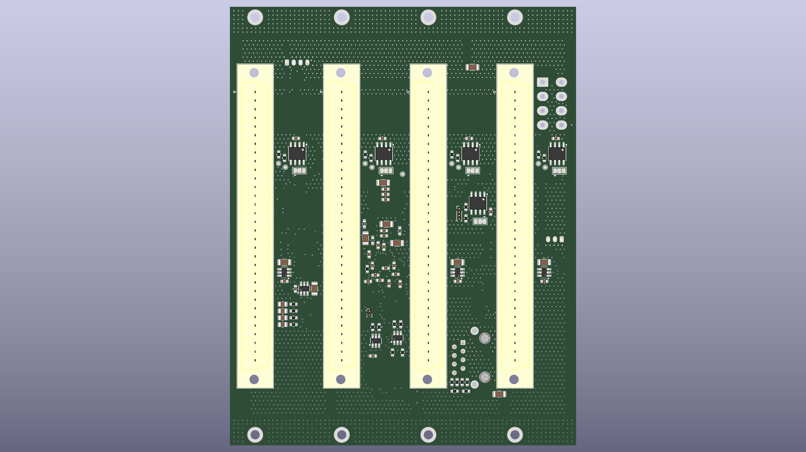
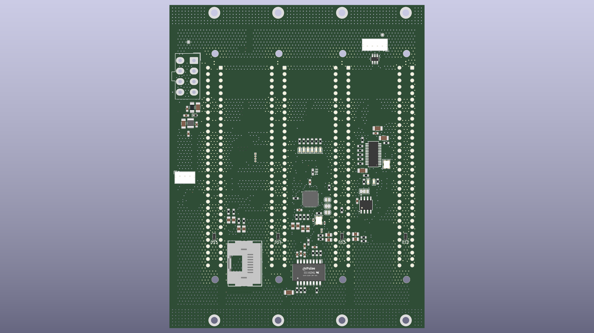
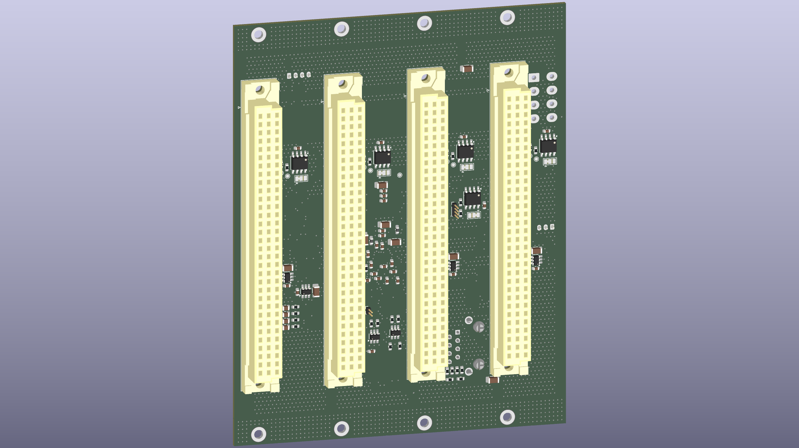

# QCB (Quad Card Backplane)

Quad Card Backplane for 3U eurocards. Splits USB 2.0 and 10/100M Ethernet (plus RS485 and an ID EEPROM) out to 4 eurocards.



<p align="center">
  
  
</p>

---

## Status: WIP

- Schematic and PCB routing are done (rev 0.1).
- A full design review (schematic + PCB + EMC + SPICE) was completed on 2026-08-03; see [Documentation](#documentation) below.
- Remaining before ordering: fill in BOM manufacturer part numbers, resolve the UT8413A footprint/datasheet, add fiducial markers.

---

## Architecture

The board is a backplane hub card built around two switching ICs, fanned out to 4 identical eurocard channels:

- **U1 (FE1.1s)** — 4-port USB 2.0 Hi-Speed hub, one port per channel.
- **IC1 (IP175G)** — 5-port 10/100 Ethernet switch. One port is broken out to an RJ45 (J3) via magnetics (H1102NL); the other 4 go to the channels.
- **4× channel (`con1.kicad_sch`, reused as CON1–CON4)** — each with its own USB D+/D-, Ethernet TX/RX pairs, RS485±, ESD protection, and an identification EEPROM (M24C02) on its own I2C bus.
- **`pwr.kicad_sch`** — power input (Molex Mini-Fit connector J6), polyfuse, ferrite bead, ESD protection. No on-board regulator — +3.3V/+5V/+12V are supplied by the backplane.
- Channels land on 4 backplane connectors (DIN41612 2×32, J7–J10).

4-layer PCB (F.Cu / In1.Cu / In2.Cu / B.Cu), 101.6 × 128.7 mm, 216 components.

## Features

- 10/100 Ethernet switch with an external RJ45 port
- USB 2.0 Hi-Speed 4-port hub
- Per-channel RS485 and identification EEPROM
- 4× 3U 6TE eurocard, IEEE 1101.1-1998 format (128 × 30.1 mm)
- Powered entirely from the backplane (no on-board regulator)

## Repository structure

```
pcb/        KiCad project (schematic, PCB, jobsets, 3D packages, datasheets cache)
doc/        Design review report and TODO list (tracked, human-readable)
media/      Renders/photos used in this README
prod/       Generated production outputs (gerbers/zip, BOM, schematic & PCB PDFs)
analysis/   Raw output of automated design-review tooling (gitignored, regenerable)
```

## Documentation

- [doc/DESIGN_REVIEW_2026-08-03.md](doc/DESIGN_REVIEW_2026-08-03.md) — full schematic/PCB/EMC/SPICE design review
- [doc/TODO.md](doc/TODO.md) — outstanding items before the board can be ordered

## License and Contribution

[MIT License](/LICENSE)

Open to contributions in both software and hardware!
